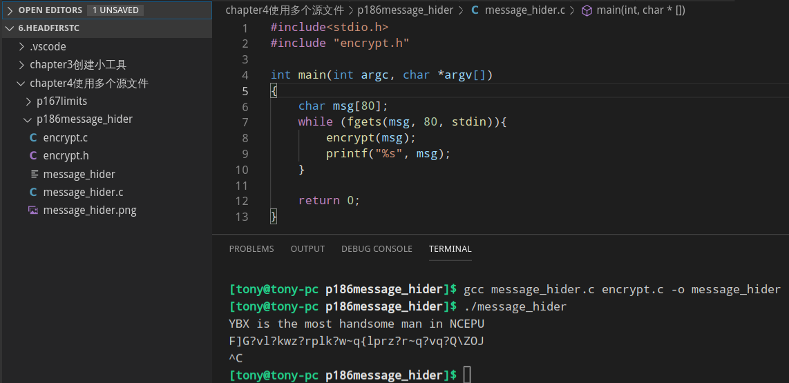
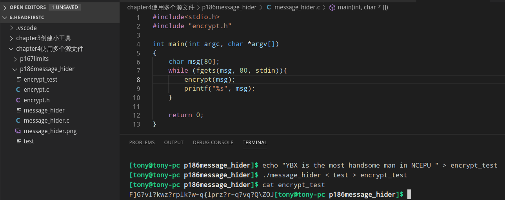
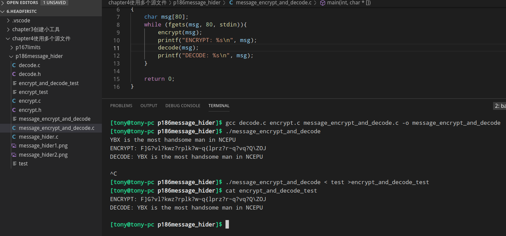

### 程序的拆解
把程序拆解成独立的源文件,意味着<b>程序之间共享代码</b>,每一个模块单独维护和开发

### 书上案例
```
$> gcc decode.c encrypt.c message_hider.c -o message_hider
```



### 思考题——添加解密功能
```
$> gcc decode.c encrypt.c message_encrypt_and_decode.c -o message_encrypt_and_decode
```

