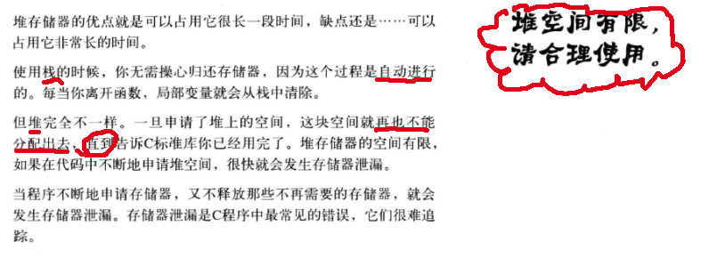
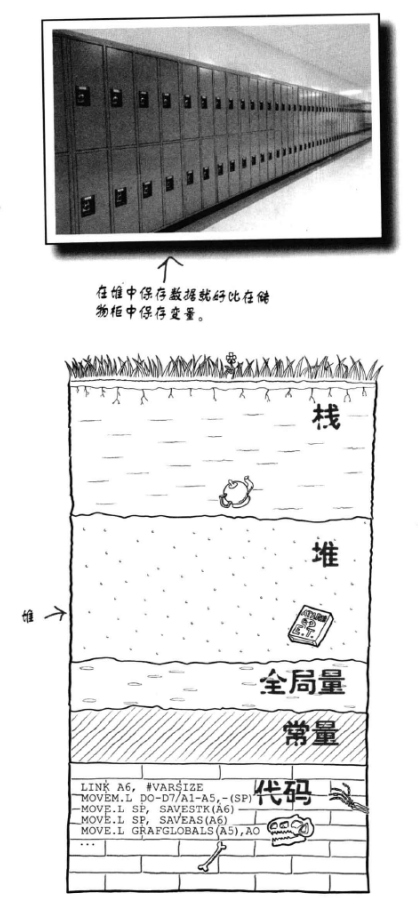

# chapter6 数据结构与动态存储
一般情况下,C语言数据存储在<b>栈</b>中,因为栈是用来存储局部变量的地方,数据存储在局部变量里面,一旦离开函数,变量就会消失<br>
### 栈既然可以自动释放,那为什么还需要堆?

因为栈不能分配大量的空间,<b>堆</b>是用来存储长时间的数据地方,<b>不过堆的数据是不会自动清除的,需要自己手动释放</b><br>


``` c
为了使用 malloc 与 free 
#include <stdlib.h>
或者
#include <malloc.h>
    ... 
    island *p = malloc(sizeof(island)); //malloc()会返回一个指针,指向新分配的空间
    ... 
    free(p);    //记住用malloc申请的变量,对应后面用free();
    ... 
``` 

通常情况下,在程序结束时操作系统会释放全部数据,但是为了养成一个好习惯,最好还是malloc()后面跟一个free()