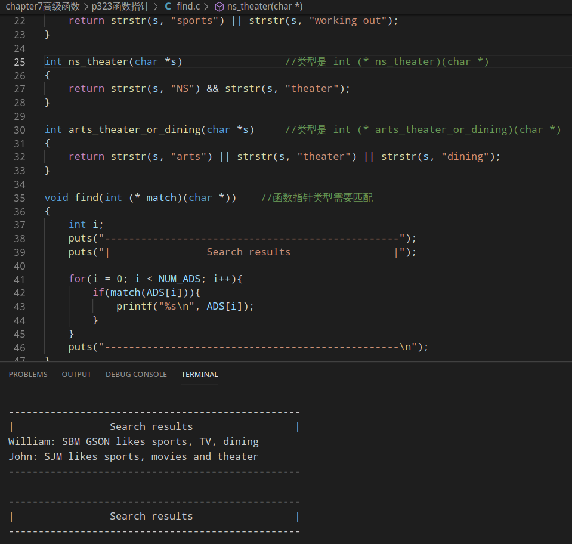
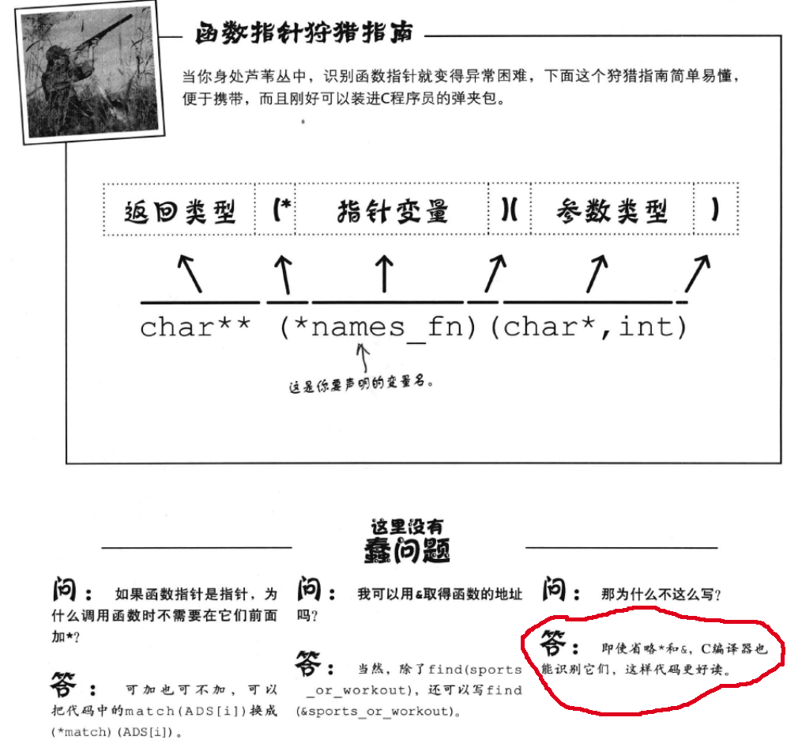

### 寻找真名天子
改进版,使用函数指针进行操作


```c
//核心代码
int sports_no_bieber(char *s)           //类型是 int (* sports_no_bieber)(char *)
int sport_or_workout(char *s)           //类型是 int (* sport_or_workout)(char *)
int ns_theater(char *s)                 //类型是 int (* ns_theater)(char *)
int arts_theater_or_dining(char *s)     //类型是 int (* arts_theater_or_dining)(char *)

void find(int (* match)(char *))        //函数指针类型需要匹配,所以这里使用int (* match)(char *)
```
### 关于函数指针需要注意的地方

