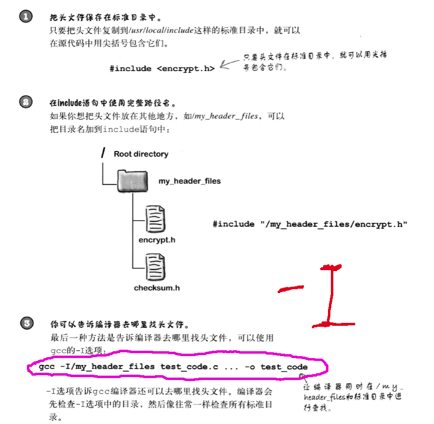
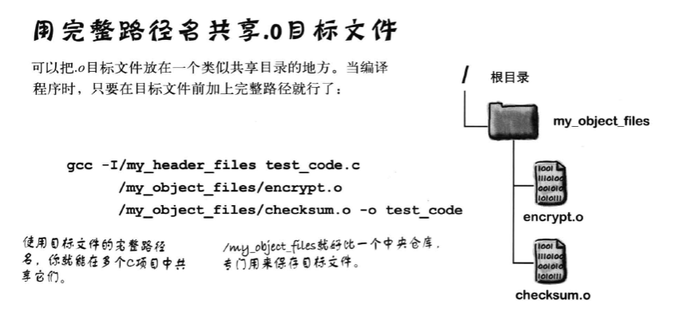
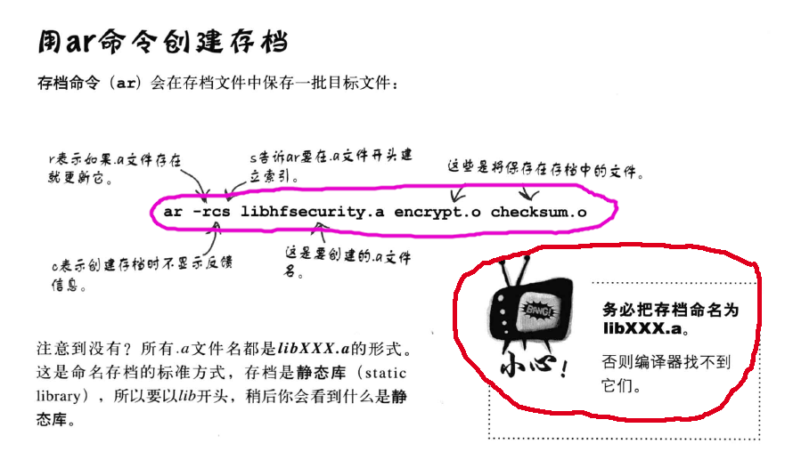
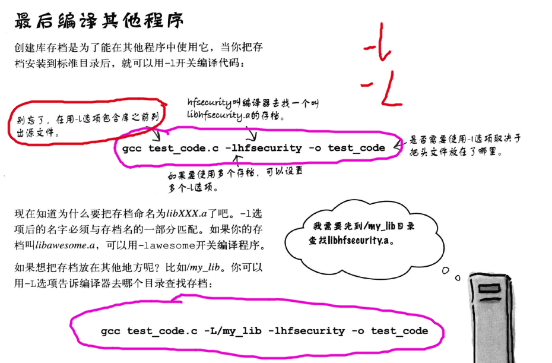
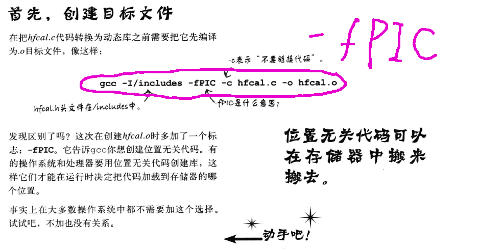
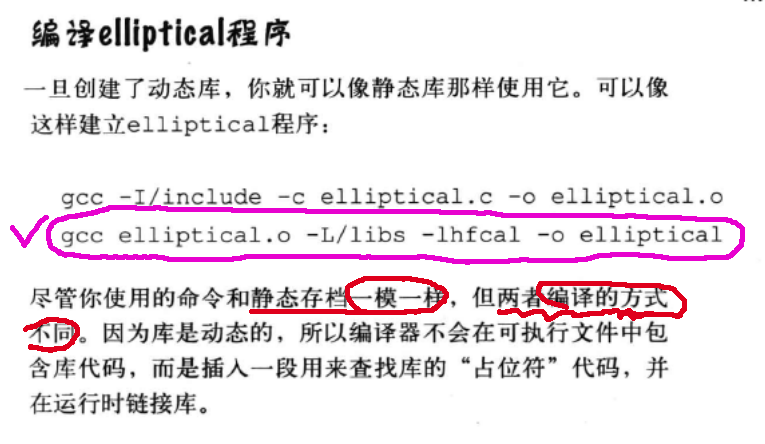
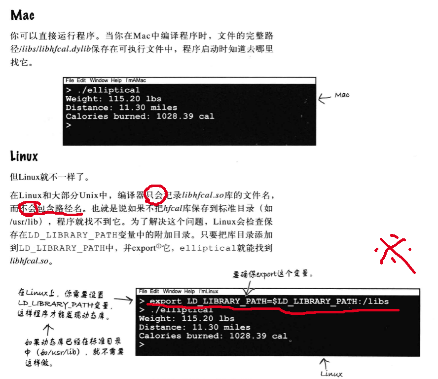

### 对于gcc来说到哪里寻找头文件 .h

## 共享代码
### 一、共享.h

### 二、共享.o
#### 方式一

#### 方式二
##### 1制作静态链接库

使用

> 总结一下
> -I<.h文件目录>
> -L<指定寻找的目录>
> -l<库文件>    可以直接写中间的部分

##### 2制作动态链接库
###### 1)生成目标文件

###### 2)制作动态链接库

###### 3)编译

###### 4)运行

### 总结
