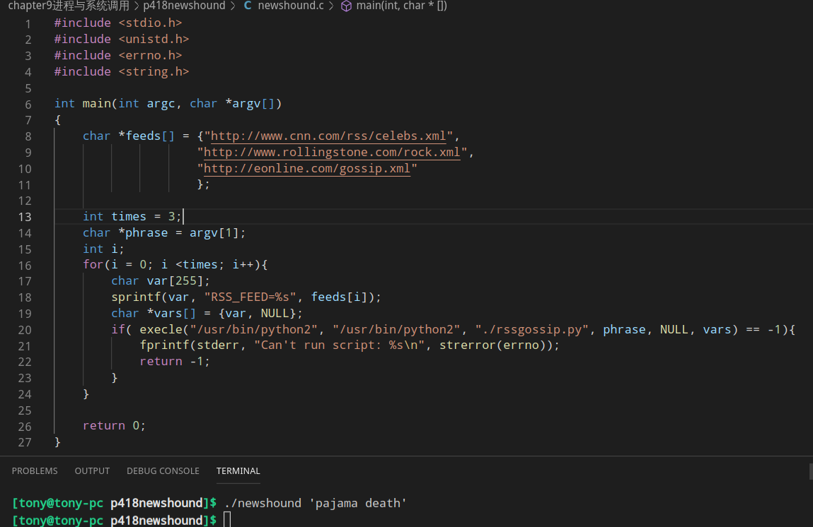

### RSS GOSSIP
==========

This is a very, very simple Python module to read the contents of an RSS feed and look for a key phrase.

For example, to look for stories about 'Snooki' in the MSN Entertainment feed, you can do this:

 export RSS_FEED=http://www.msn.com/rss/MsnEntertainment.aspx
 ./rssgossip.py 'Snooki' 

Why does the script configure the feed using an environment variable? Because this module was written as 
an example program for the book Head First C (http://shop.oreilly.com/product/0636920015482.do). The book
needed an example external program that required command line arguments as well as environment variables.

If you want the script to search more than one feed, set RSS_FEED a list of space-separated URLs.

The search string can be a regular expression. So:

 ./rssgossip.py 'lohan|britney|kardashian'

will find stories containing any of the three names.

### 练习

